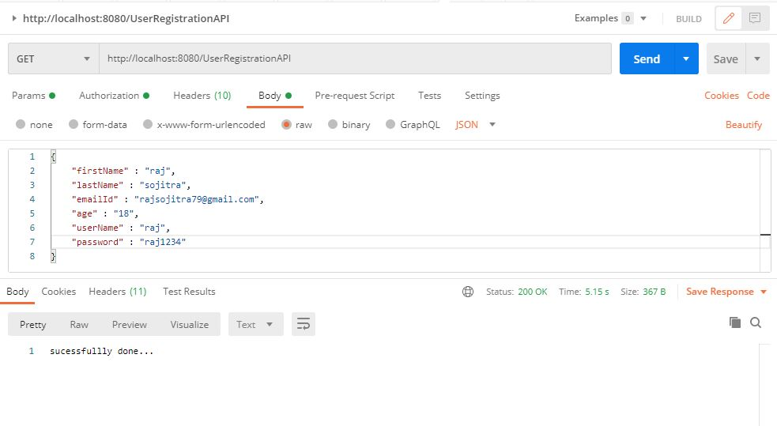
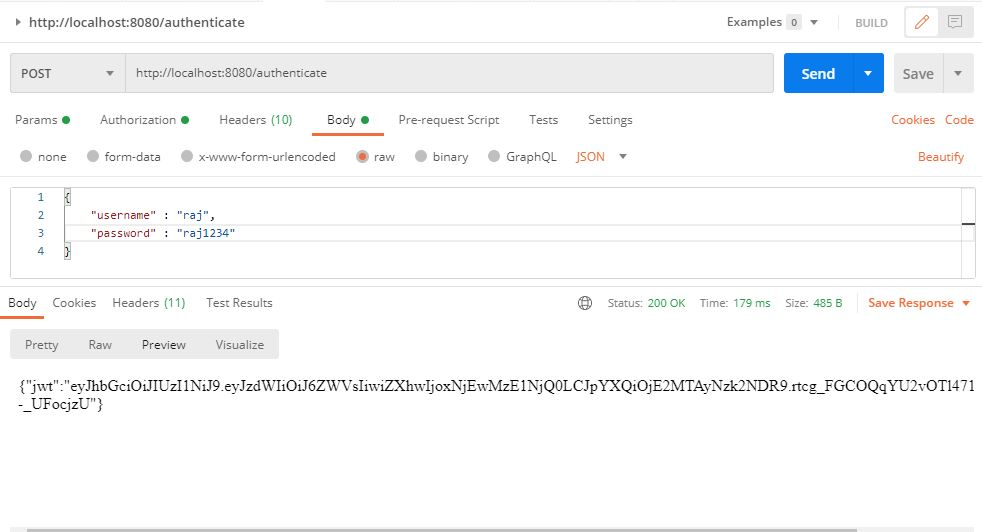
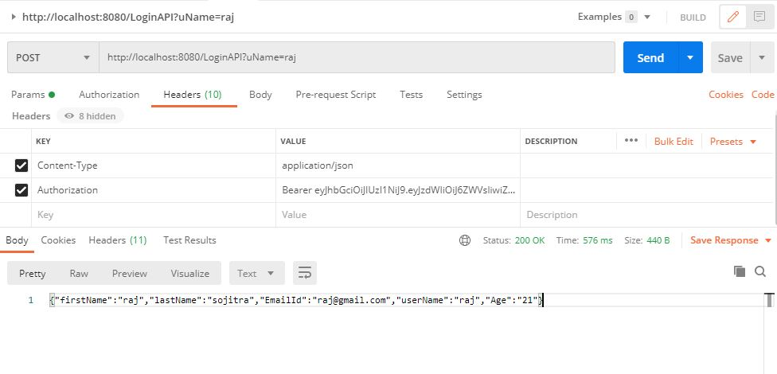
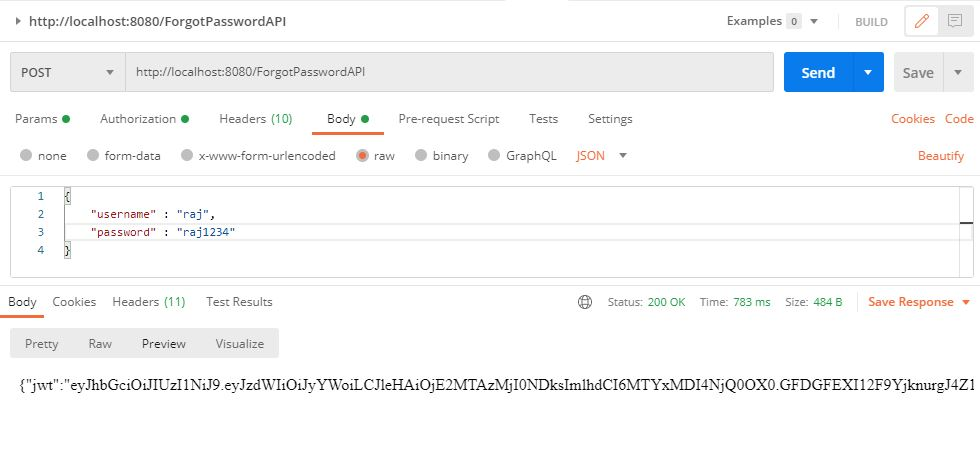
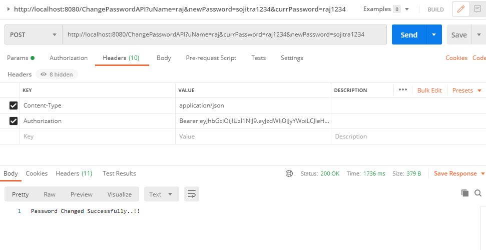
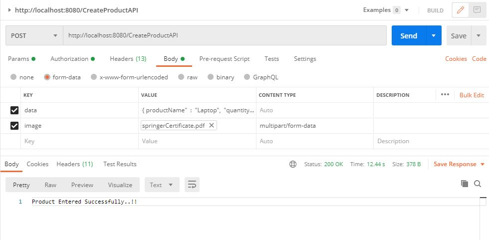
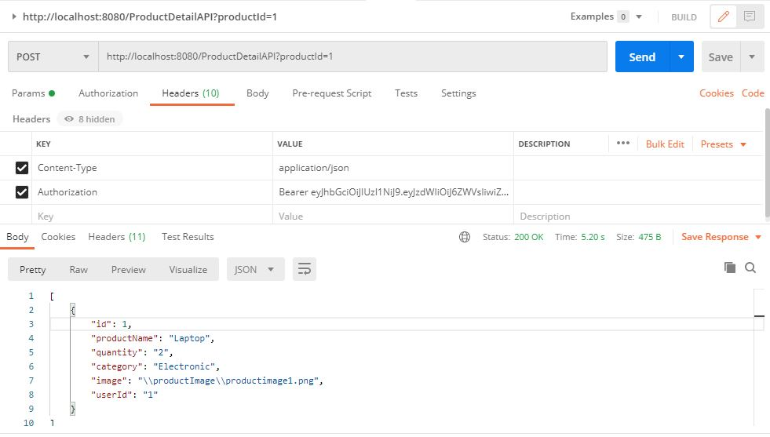
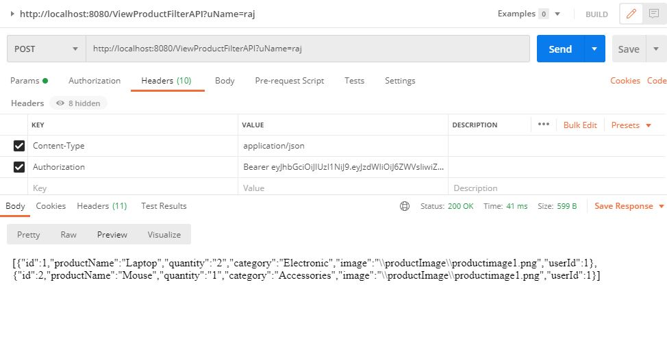

# OpenXcell
Spring boot + JWT + Spring Security + login/Registration/Product API

This Project Contains BackEnd API of User Login/Registration API Using Spring boot and Spring Security Freamwork woth JWT (Json Web Token).

1) UserRegistrationAPI
- First Name
- Last Name
- Email Address (unique)
- Age (18+ years)
- Username (Unique)
- Password (Alphanumeric == Alphabets+Numeric)

2) AuthenticateAPI
-username/Email
-password
it will return JWT token.

3) LoginAPI
-Email/Username
-Password
Login is authenticated using JWT(Java Web Token).
If login success, it should return all the user information along with AccessToken.
Below Images shows return JWt AccessToken.

4) Logout API
- pass jwt Access token with Authentication header as a key value pair
For Ex.
key : Authentication       (must be Authentication)
value : Bearer jwt

5) ForgotPasswordAPI
-	Email Address/username 
- it shoud return jwt token change password.

6) ChangePasswprdAPI
-	AccessToken
-	NewPassword
-	CurrentPassword

7) CreateProductAPI
-	AccessToken
-	Name
-	Quantity
-	Category
-	Image (Multiple images)

8) ProductDetailAPI
-	Accesstoken
-	ProductID
- it will return the product Details.

9) ViewProductFilterAPI 
-It should return all products related to that user with product detail information.

